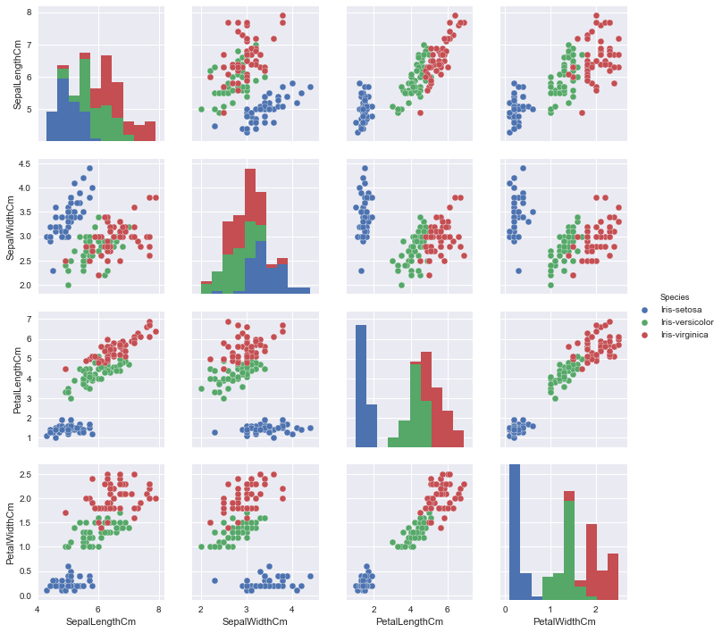

```python
my_list= [45.4, 44.2, 36.8, 35.1, 39.0, 60.0, 47.4, 41.1, 45.8, 35.6]
```


```python
my_list[4]
```


    39.0


```python
my_list.append(55.2)
```


```python
my_list
```


    [45.4, 44.2, 36.8, 35.1, 39.0, 60.0, 47.4, 41.1, 45.8, 35.6, 55.2]


```python
my_list.pop(5)
```


    60.0


```python
for i in range(0,10):
   if my_list[i]>45:
        print(my_list[i])
```

    45.4
    47.4
    45.8
    55.2
    


```python
import numpy
```


```python
numpy.array(my_list)
```


    array([ 45.4,  44.2,  36.8,  35.1,  39. ,  47.4,  41.1,  45.8,  35.6,  55.2])


```python
numpy.mean(my_list)
```


    42.560000000000002


```python
numpy.std(my_list)
```


    5.9709630713981143


```python
result = []
for i in range(0,10):
    result.append(my_list[i]<45)
    
result = numpy.array(result)
mylist = numpy.array(my_list)
mylist[result]
```


    array([ 44.2,  36.8,  35.1,  39. ,  41.1,  35.6])


```python
numpy.max(my_list)
```


    55.200000000000003


```python
numpy.min(my_list)
```


    35.100000000000001


```python
import pandas
```


```python
iris = pandas.read_csv('c:/Users/sahluwalia/Downloads/Iris.csv', skipinitialspace=True,engine='python',)
```


```python
iris.head()
```


<div>
<table border="1" class="dataframe">
  <thead>
    <tr style="text-align: right;">
      <th></th>
      <th>Id</th>
      <th>SepalLengthCm</th>
      <th>SepalWidthCm</th>
      <th>PetalLengthCm</th>
      <th>PetalWidthCm</th>
      <th>Species</th>
    </tr>
  </thead>
  <tbody>
    <tr>
      <th>0</th>
      <td>1</td>
      <td>5.1</td>
      <td>3.5</td>
      <td>1.4</td>
      <td>0.2</td>
      <td>Iris-setosa</td>
    </tr>
    <tr>
      <th>1</th>
      <td>2</td>
      <td>4.9</td>
      <td>3.0</td>
      <td>1.4</td>
      <td>0.2</td>
      <td>Iris-setosa</td>
    </tr>
    <tr>
      <th>2</th>
      <td>3</td>
      <td>4.7</td>
      <td>3.2</td>
      <td>1.3</td>
      <td>0.2</td>
      <td>Iris-setosa</td>
    </tr>
    <tr>
      <th>3</th>
      <td>4</td>
      <td>4.6</td>
      <td>3.1</td>
      <td>1.5</td>
      <td>0.2</td>
      <td>Iris-setosa</td>
    </tr>
    <tr>
      <th>4</th>
      <td>5</td>
      <td>5.0</td>
      <td>3.6</td>
      <td>1.4</td>
      <td>0.2</td>
      <td>Iris-setosa</td>
    </tr>
  </tbody>
</table>
</div>


```python
iris = iris.drop('Id', 1)
```


```python
iris.head()
```


<div>
<table border="1" class="dataframe">
  <thead>
    <tr style="text-align: right;">
      <th></th>
      <th>SepalLengthCm</th>
      <th>SepalWidthCm</th>
      <th>PetalLengthCm</th>
      <th>PetalWidthCm</th>
      <th>Species</th>
    </tr>
  </thead>
  <tbody>
    <tr>
      <th>0</th>
      <td>5.1</td>
      <td>3.5</td>
      <td>1.4</td>
      <td>0.2</td>
      <td>Iris-setosa</td>
    </tr>
    <tr>
      <th>1</th>
      <td>4.9</td>
      <td>3.0</td>
      <td>1.4</td>
      <td>0.2</td>
      <td>Iris-setosa</td>
    </tr>
    <tr>
      <th>2</th>
      <td>4.7</td>
      <td>3.2</td>
      <td>1.3</td>
      <td>0.2</td>
      <td>Iris-setosa</td>
    </tr>
    <tr>
      <th>3</th>
      <td>4.6</td>
      <td>3.1</td>
      <td>1.5</td>
      <td>0.2</td>
      <td>Iris-setosa</td>
    </tr>
    <tr>
      <th>4</th>
      <td>5.0</td>
      <td>3.6</td>
      <td>1.4</td>
      <td>0.2</td>
      <td>Iris-setosa</td>
    </tr>
  </tbody>
</table>
</div>


```python
iris1 = iris.query('Species == "Iris-setosa"')
```


```python
iris1
```


<div>
<table border="1" class="dataframe">
  <thead>
    <tr style="text-align: right;">
      <th></th>
      <th>SepalLengthCm</th>
      <th>SepalWidthCm</th>
      <th>PetalLengthCm</th>
      <th>PetalWidthCm</th>
      <th>Species</th>
    </tr>
  </thead>
  <tbody>
    <tr>
      <th>0</th>
      <td>5.1</td>
      <td>3.5</td>
      <td>1.4</td>
      <td>0.2</td>
      <td>Iris-setosa</td>
    </tr>
    <tr>
      <th>1</th>
      <td>4.9</td>
      <td>3.0</td>
      <td>1.4</td>
      <td>0.2</td>
      <td>Iris-setosa</td>
    </tr>
    <tr>
      <th>2</th>
      <td>4.7</td>
      <td>3.2</td>
      <td>1.3</td>
      <td>0.2</td>
      <td>Iris-setosa</td>
    </tr>
    <tr>
      <th>3</th>
      <td>4.6</td>
      <td>3.1</td>
      <td>1.5</td>
      <td>0.2</td>
      <td>Iris-setosa</td>
    </tr>
    <tr>
      <th>4</th>
      <td>5.0</td>
      <td>3.6</td>
      <td>1.4</td>
      <td>0.2</td>
      <td>Iris-setosa</td>
    </tr>
    <tr>
      <th>5</th>
      <td>5.4</td>
      <td>3.9</td>
      <td>1.7</td>
      <td>0.4</td>
      <td>Iris-setosa</td>
    </tr>
    <tr>
      <th>6</th>
      <td>4.6</td>
      <td>3.4</td>
      <td>1.4</td>
      <td>0.3</td>
      <td>Iris-setosa</td>
    </tr>
    <tr>
      <th>7</th>
      <td>5.0</td>
      <td>3.4</td>
      <td>1.5</td>
      <td>0.2</td>
      <td>Iris-setosa</td>
    </tr>
    <tr>
      <th>8</th>
      <td>4.4</td>
      <td>2.9</td>
      <td>1.4</td>
      <td>0.2</td>
      <td>Iris-setosa</td>
    </tr>
    <tr>
      <th>9</th>
      <td>4.9</td>
      <td>3.1</td>
      <td>1.5</td>
      <td>0.1</td>
      <td>Iris-setosa</td>
    </tr>
    <tr>
      <th>10</th>
      <td>5.4</td>
      <td>3.7</td>
      <td>1.5</td>
      <td>0.2</td>
      <td>Iris-setosa</td>
    </tr>
    <tr>
      <th>11</th>
      <td>4.8</td>
      <td>3.4</td>
      <td>1.6</td>
      <td>0.2</td>
      <td>Iris-setosa</td>
    </tr>
    <tr>
      <th>12</th>
      <td>4.8</td>
      <td>3.0</td>
      <td>1.4</td>
      <td>0.1</td>
      <td>Iris-setosa</td>
    </tr>
    <tr>
      <th>13</th>
      <td>4.3</td>
      <td>3.0</td>
      <td>1.1</td>
      <td>0.1</td>
      <td>Iris-setosa</td>
    </tr>
    <tr>
      <th>14</th>
      <td>5.8</td>
      <td>4.0</td>
      <td>1.2</td>
      <td>0.2</td>
      <td>Iris-setosa</td>
    </tr>
    <tr>
      <th>15</th>
      <td>5.7</td>
      <td>4.4</td>
      <td>1.5</td>
      <td>0.4</td>
      <td>Iris-setosa</td>
    </tr>
    <tr>
      <th>16</th>
      <td>5.4</td>
      <td>3.9</td>
      <td>1.3</td>
      <td>0.4</td>
      <td>Iris-setosa</td>
    </tr>
    <tr>
      <th>17</th>
      <td>5.1</td>
      <td>3.5</td>
      <td>1.4</td>
      <td>0.3</td>
      <td>Iris-setosa</td>
    </tr>
    <tr>
      <th>18</th>
      <td>5.7</td>
      <td>3.8</td>
      <td>1.7</td>
      <td>0.3</td>
      <td>Iris-setosa</td>
    </tr>
    <tr>
      <th>19</th>
      <td>5.1</td>
      <td>3.8</td>
      <td>1.5</td>
      <td>0.3</td>
      <td>Iris-setosa</td>
    </tr>
    <tr>
      <th>20</th>
      <td>5.4</td>
      <td>3.4</td>
      <td>1.7</td>
      <td>0.2</td>
      <td>Iris-setosa</td>
    </tr>
    <tr>
      <th>21</th>
      <td>5.1</td>
      <td>3.7</td>
      <td>1.5</td>
      <td>0.4</td>
      <td>Iris-setosa</td>
    </tr>
    <tr>
      <th>22</th>
      <td>4.6</td>
      <td>3.6</td>
      <td>1.0</td>
      <td>0.2</td>
      <td>Iris-setosa</td>
    </tr>
    <tr>
      <th>23</th>
      <td>5.1</td>
      <td>3.3</td>
      <td>1.7</td>
      <td>0.5</td>
      <td>Iris-setosa</td>
    </tr>
    <tr>
      <th>24</th>
      <td>4.8</td>
      <td>3.4</td>
      <td>1.9</td>
      <td>0.2</td>
      <td>Iris-setosa</td>
    </tr>
    <tr>
      <th>25</th>
      <td>5.0</td>
      <td>3.0</td>
      <td>1.6</td>
      <td>0.2</td>
      <td>Iris-setosa</td>
    </tr>
    <tr>
      <th>26</th>
      <td>5.0</td>
      <td>3.4</td>
      <td>1.6</td>
      <td>0.4</td>
      <td>Iris-setosa</td>
    </tr>
    <tr>
      <th>27</th>
      <td>5.2</td>
      <td>3.5</td>
      <td>1.5</td>
      <td>0.2</td>
      <td>Iris-setosa</td>
    </tr>
    <tr>
      <th>28</th>
      <td>5.2</td>
      <td>3.4</td>
      <td>1.4</td>
      <td>0.2</td>
      <td>Iris-setosa</td>
    </tr>
    <tr>
      <th>29</th>
      <td>4.7</td>
      <td>3.2</td>
      <td>1.6</td>
      <td>0.2</td>
      <td>Iris-setosa</td>
    </tr>
    <tr>
      <th>30</th>
      <td>4.8</td>
      <td>3.1</td>
      <td>1.6</td>
      <td>0.2</td>
      <td>Iris-setosa</td>
    </tr>
    <tr>
      <th>31</th>
      <td>5.4</td>
      <td>3.4</td>
      <td>1.5</td>
      <td>0.4</td>
      <td>Iris-setosa</td>
    </tr>
    <tr>
      <th>32</th>
      <td>5.2</td>
      <td>4.1</td>
      <td>1.5</td>
      <td>0.1</td>
      <td>Iris-setosa</td>
    </tr>
    <tr>
      <th>33</th>
      <td>5.5</td>
      <td>4.2</td>
      <td>1.4</td>
      <td>0.2</td>
      <td>Iris-setosa</td>
    </tr>
    <tr>
      <th>34</th>
      <td>4.9</td>
      <td>3.1</td>
      <td>1.5</td>
      <td>0.1</td>
      <td>Iris-setosa</td>
    </tr>
    <tr>
      <th>35</th>
      <td>5.0</td>
      <td>3.2</td>
      <td>1.2</td>
      <td>0.2</td>
      <td>Iris-setosa</td>
    </tr>
    <tr>
      <th>36</th>
      <td>5.5</td>
      <td>3.5</td>
      <td>1.3</td>
      <td>0.2</td>
      <td>Iris-setosa</td>
    </tr>
    <tr>
      <th>37</th>
      <td>4.9</td>
      <td>3.1</td>
      <td>1.5</td>
      <td>0.1</td>
      <td>Iris-setosa</td>
    </tr>
    <tr>
      <th>38</th>
      <td>4.4</td>
      <td>3.0</td>
      <td>1.3</td>
      <td>0.2</td>
      <td>Iris-setosa</td>
    </tr>
    <tr>
      <th>39</th>
      <td>5.1</td>
      <td>3.4</td>
      <td>1.5</td>
      <td>0.2</td>
      <td>Iris-setosa</td>
    </tr>
    <tr>
      <th>40</th>
      <td>5.0</td>
      <td>3.5</td>
      <td>1.3</td>
      <td>0.3</td>
      <td>Iris-setosa</td>
    </tr>
    <tr>
      <th>41</th>
      <td>4.5</td>
      <td>2.3</td>
      <td>1.3</td>
      <td>0.3</td>
      <td>Iris-setosa</td>
    </tr>
    <tr>
      <th>42</th>
      <td>4.4</td>
      <td>3.2</td>
      <td>1.3</td>
      <td>0.2</td>
      <td>Iris-setosa</td>
    </tr>
    <tr>
      <th>43</th>
      <td>5.0</td>
      <td>3.5</td>
      <td>1.6</td>
      <td>0.6</td>
      <td>Iris-setosa</td>
    </tr>
    <tr>
      <th>44</th>
      <td>5.1</td>
      <td>3.8</td>
      <td>1.9</td>
      <td>0.4</td>
      <td>Iris-setosa</td>
    </tr>
    <tr>
      <th>45</th>
      <td>4.8</td>
      <td>3.0</td>
      <td>1.4</td>
      <td>0.3</td>
      <td>Iris-setosa</td>
    </tr>
    <tr>
      <th>46</th>
      <td>5.1</td>
      <td>3.8</td>
      <td>1.6</td>
      <td>0.2</td>
      <td>Iris-setosa</td>
    </tr>
    <tr>
      <th>47</th>
      <td>4.6</td>
      <td>3.2</td>
      <td>1.4</td>
      <td>0.2</td>
      <td>Iris-setosa</td>
    </tr>
    <tr>
      <th>48</th>
      <td>5.3</td>
      <td>3.7</td>
      <td>1.5</td>
      <td>0.2</td>
      <td>Iris-setosa</td>
    </tr>
    <tr>
      <th>49</th>
      <td>5.0</td>
      <td>3.3</td>
      <td>1.4</td>
      <td>0.2</td>
      <td>Iris-setosa</td>
    </tr>
  </tbody>
</table>
</div>


```python
iris.describe()
```


<div>
<table border="1" class="dataframe">
  <thead>
    <tr style="text-align: right;">
      <th></th>
      <th>SepalLengthCm</th>
      <th>SepalWidthCm</th>
      <th>PetalLengthCm</th>
      <th>PetalWidthCm</th>
    </tr>
  </thead>
  <tbody>
    <tr>
      <th>count</th>
      <td>150.000000</td>
      <td>150.000000</td>
      <td>150.000000</td>
      <td>150.000000</td>
    </tr>
    <tr>
      <th>mean</th>
      <td>5.843333</td>
      <td>3.054000</td>
      <td>3.758667</td>
      <td>1.198667</td>
    </tr>
    <tr>
      <th>std</th>
      <td>0.828066</td>
      <td>0.433594</td>
      <td>1.764420</td>
      <td>0.763161</td>
    </tr>
    <tr>
      <th>min</th>
      <td>4.300000</td>
      <td>2.000000</td>
      <td>1.000000</td>
      <td>0.100000</td>
    </tr>
    <tr>
      <th>25%</th>
      <td>5.100000</td>
      <td>2.800000</td>
      <td>1.600000</td>
      <td>0.300000</td>
    </tr>
    <tr>
      <th>50%</th>
      <td>5.800000</td>
      <td>3.000000</td>
      <td>4.350000</td>
      <td>1.300000</td>
    </tr>
    <tr>
      <th>75%</th>
      <td>6.400000</td>
      <td>3.300000</td>
      <td>5.100000</td>
      <td>1.800000</td>
    </tr>
    <tr>
      <th>max</th>
      <td>7.900000</td>
      <td>4.400000</td>
      <td>6.900000</td>
      <td>2.500000</td>
    </tr>
  </tbody>
</table>
</div>


```python
iris.groupby(['Species']).describe()
```


<div>
<table border="1" class="dataframe">
  <thead>
    <tr style="text-align: right;">
      <th></th>
      <th></th>
      <th>PetalLengthCm</th>
      <th>PetalWidthCm</th>
      <th>SepalLengthCm</th>
      <th>SepalWidthCm</th>
    </tr>
    <tr>
      <th>Species</th>
      <th></th>
      <th></th>
      <th></th>
      <th></th>
      <th></th>
    </tr>
  </thead>
  <tbody>
    <tr>
      <th rowspan="8" valign="top">Iris-setosa</th>
      <th>count</th>
      <td>50.000000</td>
      <td>50.000000</td>
      <td>50.000000</td>
      <td>50.000000</td>
    </tr>
    <tr>
      <th>mean</th>
      <td>1.464000</td>
      <td>0.244000</td>
      <td>5.006000</td>
      <td>3.418000</td>
    </tr>
    <tr>
      <th>std</th>
      <td>0.173511</td>
      <td>0.107210</td>
      <td>0.352490</td>
      <td>0.381024</td>
    </tr>
    <tr>
      <th>min</th>
      <td>1.000000</td>
      <td>0.100000</td>
      <td>4.300000</td>
      <td>2.300000</td>
    </tr>
    <tr>
      <th>25%</th>
      <td>1.400000</td>
      <td>0.200000</td>
      <td>4.800000</td>
      <td>3.125000</td>
    </tr>
    <tr>
      <th>50%</th>
      <td>1.500000</td>
      <td>0.200000</td>
      <td>5.000000</td>
      <td>3.400000</td>
    </tr>
    <tr>
      <th>75%</th>
      <td>1.575000</td>
      <td>0.300000</td>
      <td>5.200000</td>
      <td>3.675000</td>
    </tr>
    <tr>
      <th>max</th>
      <td>1.900000</td>
      <td>0.600000</td>
      <td>5.800000</td>
      <td>4.400000</td>
    </tr>
    <tr>
      <th rowspan="8" valign="top">Iris-versicolor</th>
      <th>count</th>
      <td>50.000000</td>
      <td>50.000000</td>
      <td>50.000000</td>
      <td>50.000000</td>
    </tr>
    <tr>
      <th>mean</th>
      <td>4.260000</td>
      <td>1.326000</td>
      <td>5.936000</td>
      <td>2.770000</td>
    </tr>
    <tr>
      <th>std</th>
      <td>0.469911</td>
      <td>0.197753</td>
      <td>0.516171</td>
      <td>0.313798</td>
    </tr>
    <tr>
      <th>min</th>
      <td>3.000000</td>
      <td>1.000000</td>
      <td>4.900000</td>
      <td>2.000000</td>
    </tr>
    <tr>
      <th>25%</th>
      <td>4.000000</td>
      <td>1.200000</td>
      <td>5.600000</td>
      <td>2.525000</td>
    </tr>
    <tr>
      <th>50%</th>
      <td>4.350000</td>
      <td>1.300000</td>
      <td>5.900000</td>
      <td>2.800000</td>
    </tr>
    <tr>
      <th>75%</th>
      <td>4.600000</td>
      <td>1.500000</td>
      <td>6.300000</td>
      <td>3.000000</td>
    </tr>
    <tr>
      <th>max</th>
      <td>5.100000</td>
      <td>1.800000</td>
      <td>7.000000</td>
      <td>3.400000</td>
    </tr>
    <tr>
      <th rowspan="8" valign="top">Iris-virginica</th>
      <th>count</th>
      <td>50.000000</td>
      <td>50.000000</td>
      <td>50.000000</td>
      <td>50.000000</td>
    </tr>
    <tr>
      <th>mean</th>
      <td>5.552000</td>
      <td>2.026000</td>
      <td>6.588000</td>
      <td>2.974000</td>
    </tr>
    <tr>
      <th>std</th>
      <td>0.551895</td>
      <td>0.274650</td>
      <td>0.635880</td>
      <td>0.322497</td>
    </tr>
    <tr>
      <th>min</th>
      <td>4.500000</td>
      <td>1.400000</td>
      <td>4.900000</td>
      <td>2.200000</td>
    </tr>
    <tr>
      <th>25%</th>
      <td>5.100000</td>
      <td>1.800000</td>
      <td>6.225000</td>
      <td>2.800000</td>
    </tr>
    <tr>
      <th>50%</th>
      <td>5.550000</td>
      <td>2.000000</td>
      <td>6.500000</td>
      <td>3.000000</td>
    </tr>
    <tr>
      <th>75%</th>
      <td>5.875000</td>
      <td>2.300000</td>
      <td>6.900000</td>
      <td>3.175000</td>
    </tr>
    <tr>
      <th>max</th>
      <td>6.900000</td>
      <td>2.500000</td>
      <td>7.900000</td>
      <td>3.800000</td>
    </tr>
  </tbody>
</table>
</div>


```python
iris.groupby('Species').boxplot()
```


    Iris-setosa             Axes(0.1,0.559091;0.363636x0.340909)
    Iris-versicolor    Axes(0.536364,0.559091;0.363636x0.340909)
    Iris-virginica              Axes(0.1,0.15;0.363636x0.340909)
    dtype: object


```python
!pip install seaborn
```

    Requirement already satisfied: seaborn in c:\programdata\anaconda3\lib\site-packages
    


```python
import seaborn as sns
```


```python
%matplotlib inline
```


```python
sns.pairplot(iris,hue='Species')
```


    <seaborn.axisgrid.PairGrid at 0xb484a90>





```python

```
